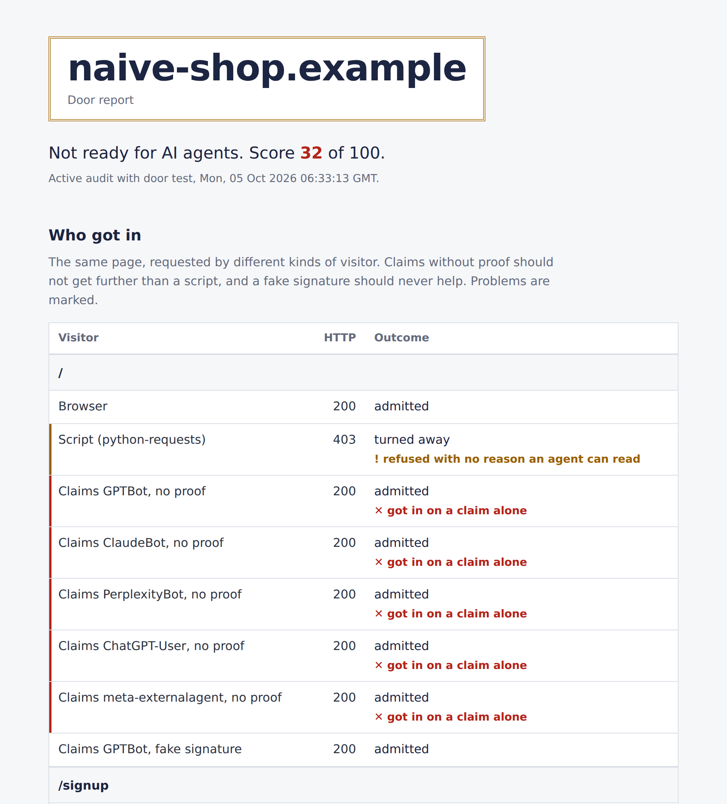

# agent-doorman

[](https://github.com/anpanmanj987-hub/agent-doorman/actions/workflows/ci.yml)
[](LICENSE)


**AIエージェントを入口で確かめる。** 自分のサイトがAIエージェントのアクセスをどう扱っているかを調べ、署名で本人確認できたエージェントは通し、なりすましは止めます。実行時の依存パッケージはありません。

[English README](README.md)

インストールせずに試せます（Node.js 20以上）。

```sh
npx --yes --package=https://github.com/anpanmanj987-hub/agent-doorman/releases/download/v0.1.0/agent-doorman-0.1.0.tgz   agent-doorman audit https://your-site.example --path /checkout
```



## なぜ必要か

本人の代わりに予約、ログイン、購入まで行う個人向けエージェントが広がっています。多くのサイトはUser-Agentの規則で対応していますが、この方法は二つの点で機能しません。

- **なりすましが通る。** User-Agentは自己申告です。`GPTBot` を許可する規則を置けば、`GPTBot` と名乗った誰でも通れます。DataDomeの調査では、検査したサイトの10件中7件が、GPTBotなどを名乗るだけの偽のアクセスを確認なしで通していました（[DataDome](https://datadome.co/threat-research/meta-muse-doesnt-declare-itself-heres-why-that-matters/)）。
- **本物のエージェントが止まる、またはまとめて締め出される。** 実際のブラウザを操作し、名乗らないエージェントは人と区別できません。AmazonはMetaのエージェント「Muse」を、AIエージェントだと名乗らずに閲覧しているとしてブロックしました（[TechRepublic](https://www.techrepublic.com/article/news-amazon-blocks-meta-muse/)）。

[Web Bot Auth](https://datatracker.ietf.org/doc/draft-meunier-webbotauth-httpsig-protocol/) は本人確認の部分を解決します。エージェントはHTTP Message Signatures（RFC 9421）でリクエストに署名して公開鍵を公開し、サイトはその署名で相手を確かめられます。agent-doormanはこの仕組みのサイト側の実装と、現状を把握するための監査をまとめたものです。

## できること

| | |
|---|---|
| `agent-doorman audit` | 入館テスト（ブラウザ、スクリプト、AIを名乗るだけのアクセス、偽の署名、自分の鍵で署名したエージェント）と、エージェントに必要な条件の検査です。読めるHTML、ラベル付きのフォーム、autocomplete、構造化データ、障壁の有無を調べます。出力はテキスト、JSON、Markdown、HTML、バッジです。 |
| ゲート（ミドルウェア） | Web Bot Authの署名を検証し、リクエストを6種類に分類して、パスごとのポリシーを適用します。たとえば「閲覧は誰でも可、決済は人か署名検証済みのエージェントのみ」とできます。まず監視モードで記録だけを行い、準備ができたら遮断に切り替えます。 |
| 動作環境 | Node.js（`node:http`、Express、Connect）と、Fetch APIの各実行環境（Cloudflare Workers、Next.jsのmiddleware、Deno、Bun）。依存パッケージはありません。 |
| 仕様への準拠 | Web Bot AuthドラフトのEd25519テストベクトルに合格し、署名側は公開された署名値をバイト単位で再現します。 |

## インストール

agent-doormanはまだnpmレジストリには公開していません。GitHubのリリースから導入します。

```sh
npm install https://github.com/anpanmanj987-hub/agent-doorman/releases/download/v0.1.0/agent-doorman-0.1.0.tgz
```

導入後は `npx --no-install agent-doorman ...` で実行します（`--no-install` は、同じ名前の別パッケージをnpxが取得しないようにするためです）。

## サイトを監査する

```sh
# 受動モード：公開ページを読むだけ。どのサイトにも使えます。
npx --no-install agent-doorman audit https://example.com --path /cart --path /checkout --html report.html

# 能動モード：入館テストを追加します。自分が運営するサイトにだけ使ってください。
npx --no-install agent-doorman audit https://staging.example.com --active --path /checkout
```

入館テストでは、同じページを異なる訪問者として要求し、結果を比べます。

| 訪問者 | 通された場合にわかること |
|---|---|
| ブラウザ | 基準です。これが拒否されるなら、実ブラウザを使うエージェントも拒否されます。 |
| スクリプト（`python-requests`） | 自動化ツールの基準です。 |
| GPTBot、ClaudeBot、PerplexityBotなどを名乗るだけ | スクリプトは拒否されるのにこちらが通るなら、誰でも名乗れる自己申告を信用しています。 |
| GPTBotを名乗り、偽の署名を付ける | でたらめな署名で、署名なしの名乗りより多くのアクセスを得られてはいけません。 |
| 署名検証済みのエージェント（`--sign-key` で自分の鍵を指定） | 許可した範囲では、署名した本物のエージェントが通る必要があります。 |

監査はGETリクエストだけを送り、フォームの送信は行いません。`--fail-under 70` を付けると、点数をCIの合否判定に使えます。このリポジトリで `npm run demo` を実行すると、対策のない店が32点、agent-doormanで守った店が100点になる様子を確認できます。

## サイトを守る

```sh
npx --no-install agent-doorman init --preset ecommerce    # 監視モードの agent-policy.json を作成
```

**Express、Connect、`node:http`**

```js
import { readFileSync } from "node:fs";
import { createDoorman, fileLogger, nodeMiddleware, validatePolicy } from "agent-doorman/node";

const policy = validatePolicy(JSON.parse(readFileSync("agent-policy.json", "utf8")));
const doorman = createDoorman({ policy, onDecision: fileLogger("agent-decisions.jsonl") });

app.use(nodeMiddleware(doorman, { getIp: (req) => req.ip }));
```

**Cloudflare Workers、Next.jsのmiddleware、Deno、Bun**

```ts
import { createDoorman, presets } from "agent-doorman";

const doorman = createDoorman({ policy: presets.ecommerce(), mode: "monitor" });

export default {
  async fetch(request: Request) {
    const blocked = await doorman.guard(request);
    return blocked ?? fetch(request);
  },
};
```

ほかの例は [`examples/`](examples/) にあります。`node:http`、Express、Workerの例は、公開用パッケージを使ってCIで実行しています（Workerはworkerd上で実行）。

### 訪問者の分類

| 分類 | 意味 |
|---|---|
| `verified` | 取得できた鍵でWeb Bot Authの署名を検証できた |
| `invalid` | 署名はあるが、偽造、期限切れ、再利用、形式不正のいずれか |
| `unverified` | 署名はあるが、鍵を取得できないか未知の鍵 |
| `claimed` | User-Agentで既知のAIエージェントを名乗るが、証明がない |
| `automated` | スクリプトや自動化ツールに見える |
| `browser` | それ以外。人か、名乗らないエージェント |

### 安全な導入手順

1. 監視モード（既定）で配備します。何も遮断せず、すべての判定を記録します。
2. `npx --no-install agent-doorman report agent-decisions.jsonl` で、遮断していたら拒否された件数を確認します。
3. `browser` と `verified` が拒否されない状態になるまで規則を調整してから、`"mode": "enforce"` に切り替えます。
4. ステージング環境に `audit --active` を実行して確認します。

CDNやロードバランサーがHostヘッダーを書き換える構成では、`trustProxy: true` を設定してください。署名はエージェントが使ったホスト名を対象にしているためです。クライアントがアプリに直接接続できる構成では設定しないでください。

ポリシーの書式と、拒否時に返す内容は [docs/agent-policy.md](docs/agent-policy.md) にあります（英語）。`/.well-known/agent-policy.json` の公開書式はこのプロジェクトが提案する試験的なもので、標準ではありません。

## 制約

- 署名せずに通常のブラウザを操作するエージェントは、人と区別できません。既存のボット対策と組み合わせてください。
- 監査はJavaScriptを実行せずにHTMLを読み、GETリクエストだけを送ります。
- レート制限とnonceの記録はメモリ上にあり、プロセス（Workersではisolate）ごとに独立します。全体で制限するには `RateLimitStore` と `NonceStore` を差し替えてください。
- `verified` は「どのオリジンが署名したか」を証明するだけで、信頼してよい相手かどうかは示しません。鍵ディレクトリは誰でも公開できます。知っているエージェントだけを通すには、その鍵を `verify.keys` に渡して `directory: false` にするか、`trust.signatureAgent` を自分の許可リストと照合してください。
- 鍵ディレクトリ自体の署名は、まだ検証していません。
- `nodeHostGuard` はプライベートアドレスに解決される名前を拒否しますが、`fetch` は名前を改めて解決するため、DNSリバインディングで競合される余地は残ります。重要な環境では、ディレクトリの取得を外向きプロキシ経由にしてください。

## 責任ある利用

`audit --active` はAIエージェントを名乗り、偽の署名を送ります。自分が運営する、または検査の許可を得たサイトにだけ使ってください。脆弱性の報告は [SECURITY.md](SECURITY.md) の方法で非公開にお願いします。

## ライセンス

[Apache-2.0](LICENSE)。[NOTICE](NOTICE) も参照してください。
